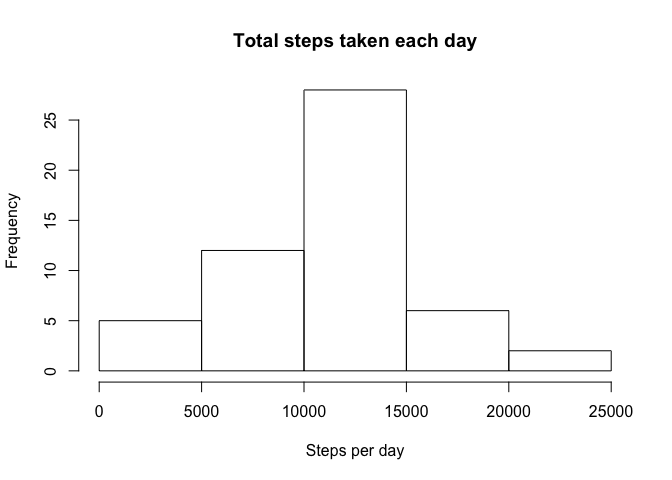
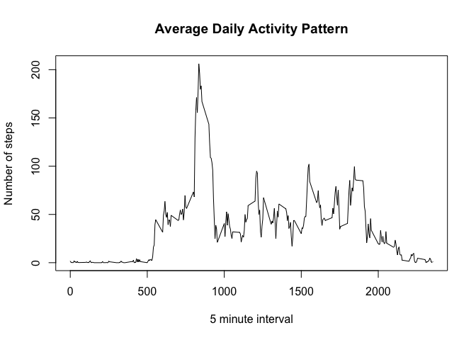
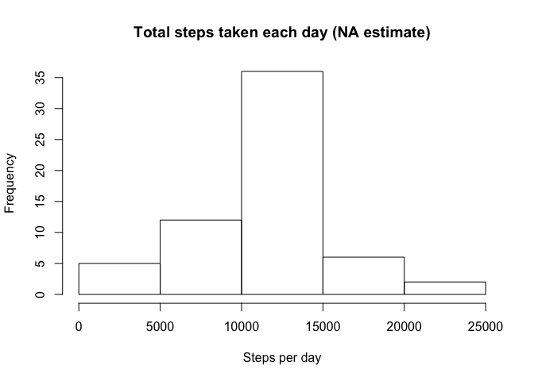
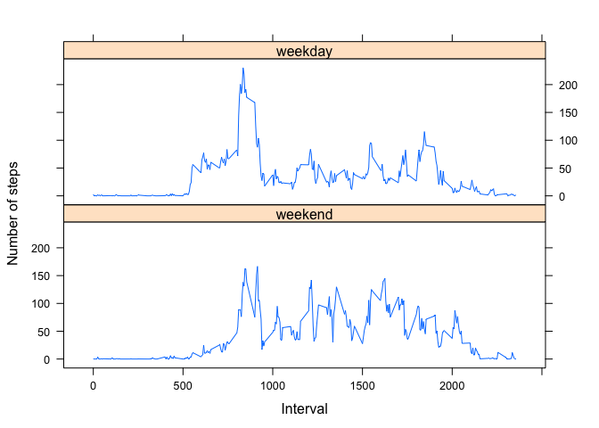

# Reproducible Research: Peer Assessment 1


## Loading and preprocessing the data
Unzip the data file and read it in R.

```r
unzip("activity.zip", exdir = "../ReproducibleResearch/")
dataset <- read.csv("../activity.csv")
```

## What is mean total number of steps taken per day?
Compute the number of steps per day and display the result in a histogram.    

```r
totalsteps <- tapply(dataset$steps, dataset$date, sum)
hist(totalsteps, main = "Total steps taken each day", xlab = "Steps per day")    
```

<!-- -->
  
The mean of the total number of steps taken per day is:

```r
mean(totalsteps, na.rm = TRUE)
```

```
## [1] 10766.19
```
The median of the total number of steps taken per day is:

```r
median(totalsteps, na.rm = TRUE)
```

```
## [1] 10765
```

## What is the average daily activity pattern?
Aggregate the dataset to obtain the average number of steps taken per interval and display the result in a time series plot.    

```r
MeanStepsInterval <- aggregate(steps ~ interval, dataset, mean, na.rm = TRUE)
plot(MeanStepsInterval$interval, MeanStepsInterval$steps, type = "l", main = "Average Daily Activity Pattern",
     xlab = "5 minute interval", ylab = "Number of steps")  
```

<!-- -->
  
The 5-minute interval which contains the maximum number of steps on average across all days can be found is computed as follows:

```r
MeanStepsInterval[which.max(MeanStepsInterval$steps),]
```

```
##     interval    steps
## 104      835 206.1698
```
Which represents the 8:35 interval.


## Imputing missing values
The number of missing values in the dataset is:

```r
sum(is.na(dataset))
```

```
## [1] 2304
```
Fill in these missing values with the mean of the 5-minute interval and store all the data in a new dataset.

```r
newdata <- dataset
newdata[is.na(newdata)] <- MeanStepsInterval$steps
```
Make a histogram of the total number of steps taken each day and report the mean and median total number of steps taken per day. 

```r
newTotalSteps <- tapply(newdata$steps, newdata$date, sum)
hist(newTotalSteps, main = "Total steps taken each day (NA estimate)", xlab = "Steps per day")
```

<!-- -->

```r
mean(newTotalSteps)
```

```
## [1] 10766.19
```

```r
median(newTotalSteps)
```

```
## [1] 10766.19
```
*Do these values differ from the estimates from the first part of the assignment? *  
The mean and median don't vary much with the estimate of the missing values.  

*What is the impact of imputing missing data on the estimates of the total daily number of steps?*  
The totl daily number of steps slighty increases with imputing missing data but not by a significant amount.  

## Are there differences in activity patterns between weekdays and weekends?
Create a new factor variable in the dataset with two levels – “weekday” and “weekend” indicating whether a given date is a weekday or weekend day.  

```r
weekends <- c("Saturday", "Sunday")
newdata$day <- factor(weekdays(as.Date(newdata$date)) %in% weekends, levels = c(TRUE,FALSE), 
                      labels = c("weekend", "weekday"))
```
Make a panel plot containing a time series plot of the 5-minute interval and the average number of steps taken, averaged across all weekday days or weekend days.

```r
newMeanStepsInterval <- aggregate(steps ~ interval+day, newdata, mean)
library(lattice)
xyplot(steps ~ interval | day, data = newMeanStepsInterval, type = "l",layout = c(1,2), 
       xlab = "Interval", ylab = "Number of steps")
```

<!-- -->
